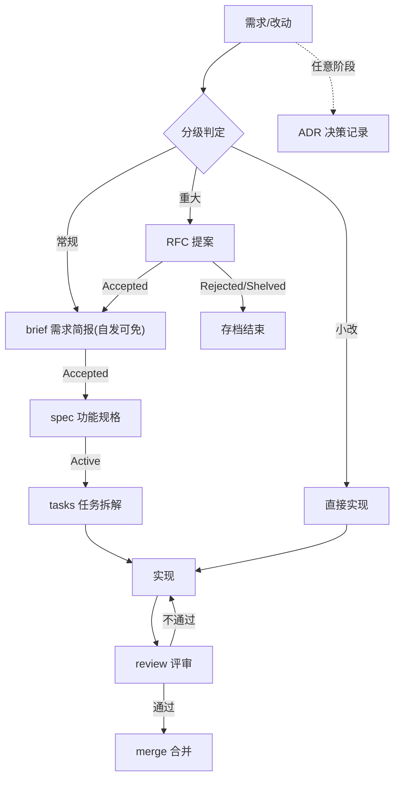

# 治理工作流

本文件是团队与 AI 协作开发的核心流程规范,定义改动分级标准、六阶段流程与 RFC / ADR 治理流程。AI 工具的执行入口见根目录 `AGENTS.md`。

## 目录

- [1. 流程总览](#1-流程总览)
- [2. 改动分级标准](#2-改动分级标准)
- [3. 六阶段详解](#3-六阶段详解)
- [4. RFC 流程](#4-rfc-流程)
- [5. ADR 流程](#5-adr-流程)
- [6. 状态与交接文档维护义务](#6-状态与交接文档维护义务)
- [7. 角色职责](#7-角色职责)
- [8. 可调参数](#8-可调参数)

## 1. 流程总览



摘要:所有改动先分级 —— 小改直接进入实现;常规级经 brief(自发可免,spec 来源填「无」)再写 spec 与 tasks;重大级先走 RFC,通过后回到常规流程;任意阶段产生的架构决策随手记 ADR。

## 2. 改动分级标准

**探索(可选前置)**:未想清楚要做什么、或不确定怎么做才干净时,先让 AI 读代码、摆方案、给推荐 —— 此阶段不产生正式文档、不改代码;想清楚后再进入分级。探索结论有留存价值的,记入 `docs/research/`。

### 2.1 小改(Direct)

须**同时满足全部**条件:

- 影响文件 ≤ 3 个,且都在同一模块或同一层内。
- 不修改任何公共接口(API、导出函数签名、数据结构、CLI 参数、配置文件格式)。
- 不新增、升级、移除依赖。
- 不改数据库 schema,不影响持久化数据格式。
- 不改目录结构、构建与 CI 配置。
- 有唯一明确的正确答案:bug 修复、文案、样式微调、注释、不改行为的重构、补测试。
- 预计一次会话或半天内完成。

流程:直接实现,commit message 写清缘由,PR 分级声明选「小改」。

### 2.2 常规(Standard)

满足**任一**条件即触发:

- 新功能、新模块、新页面或新端点。
- 预计影响文件 > 3 个,或跨模块、跨层。
- 修改公共接口但保持向后兼容(新增可选参数、新增端点)。
- 行为变更需要与需求方对齐验收标准(正确答案不显然)。
- 需要设计测试方案,而不只是补用例。
- 预计超过半天或跨多次会话。

流程:brief(自发可免)→ spec → tasks → 实现 → review。

### 2.3 重大(Major)

满足**任一**条件即触发,先走 RFC,Accepted 后转常规流程:

- 破坏向后兼容(删改公共接口、数据格式迁移、配置不兼容)。
- 新增、替换、移除运行时依赖或基础设施组件(数据库、消息队列、框架级库)。
- 引入新架构模式,或改动整体分层与目录结构。
- 影响安全模型(认证、授权、加密、权限)。
- 改动横切面(限流、可观测性、部署形态)。
- 跨服务、跨团队边界的变更。
- 修改 `AGENTS.md` 或治理流程本身(含 `docs/conventions/` 下的规范)。
- 预计 > 3 人日,或重写超过 2 个模块。

### 2.4 ADR 触发(独立于分级)

任意流程中满足任一条件即随手记录,5-10 分钟完成:选型决定(库、工具、服务);引入横切模式(错误处理、日志、鉴权方式);核心数据模型变更;显式取舍(性能 vs 简单性、一致性 vs 延迟);任何「将来难以回头」的决定。ADR 是记录不是审批。

### 2.5 元规则

1. **拿不准,升一级。** 升级的成本是一次 spec,降级的成本是返工。
2. **分级声明协议。** 超出小改标准的任务,AI 开工前 MUST 向用户输出「本次改动判断为 X 级,依据是 …」并等待确认;AI 只有建议权,确认权在人。
3. **小改累计升级。** 同一目标下连续多个小改,累计触及公共接口或累计影响 > 10 个文件时,MUST 停下来补 spec(需求动机复杂、目标非目标未对齐时先补 brief),防止用小改通道走私常规变更。
4. **禁止隐性改规范。** 会话发现实践与规范字面冲突时 MUST 二选一:按字面执行并修正既成偏差;或走规范修订流程(重大级)。MUST NOT 以工作日志拍板、惯例引用等方式形成与规范字面不一致的持续实践——违反本条的经验收、评审与复盘时作为缺陷处置依据(本条为处置依据,非过程拦截;RFC-0019)。

## 3. 六阶段详解

### 3.1 brief(需求简报)

- **谁写**:提出人,可让 AI 代笔后人工修订。从 [brief-template.md](../briefs/brief-template.md) 实例化到 `docs/briefs/NNNN-<slug>.brief.md`。
- **必含字段**:背景与问题、目标、非目标、成功指标、影响面预估。
- **合格标准**:目标与非目标可判定;成功指标可量化;影响面触及公共接口时在「关联」一节标注可能需要 RFC。
- **状态**:Proposed → Accepted(进入 spec)/ Shelved。

### 3.2 spec(功能规格)

- **谁写**:spec 负责人(通常由实现负责人担任,AI 可代笔)。从 [spec-template.md](../specs/spec-template.md) 实例化到 `docs/specs/NNNN-<slug>.spec.md`,**编号在 specs/ 内取 max+1,不沿用来源编号**(brief 与 spec 独立推进,跨流编号无关联语义);来源(BRIEF-NNNN / RFC-NNNN / 无)写入文件头「来源」字段并在注册表「来源」列登记。tasks 与 design 随来源 spec 同号:spec → 同号 tasks(恒 1:1)→ 同号同 slug design(有设计稿时)。文件头互相引用;slug SHOULD 与来源 brief 一致。
- **spec 拆分判据**:需求含多个可独立验收(各自有可判对错的 FR 集)的功能时,MUST 拆为多个 spec(各自编号,slug MAY 带母需求前缀,如 `login-page-login`);不可独立验收的内容留在同一 spec 内,施工粒度诉求由 tasks 的 Phase 分组承担。跨 spec 共享约束(统一视觉规范、公共错误处理等)上浮 tech/ 活文档后引用,不在多个 spec 重复;母需求的端到端集成场景立独立集成 spec,不散入子 spec。禁止以功能级施工文档实现一份 spec 对多份 tasks(见第 3.3 节恒 1:1)。
- **撰写要求**:
  - 方案依赖未核实的选型或外部系统行为时,先做调研并落档 `docs/research/`(按 [research-template.md](../research/research-template.md));结论以实测与源码为准,不把「文档说应该这样」当依据。
  - 现状盘点每条 MUST 附证据(文件链接、行号或实测结论),不得转述他人结论或凭记忆断言。
  - 验收标准依赖界面视觉细节时,先产出设计稿(`docs/design/`,组织规则见 [structure.md](structure.md) 5.1)并在 spec「接口设计」节链接;**设计稿定稿是 spec 转 Active 的前置** —— 否则 FR 未定型即开工。
- **评审清单**:
  - 每条验收标准(FR-N)独立可测,Given-When-Then 式表述,可判对错 ——「功能正常」「体验良好」不算标准。
  - 现状盘点有证据支撑,与当前代码一致。
  - 边界与错误路径(ER-N)显式列举,无「异常情况酌情处理」类表述。
  - 兼容性影响已声明(是否破坏、迁移方式)。
  - 主要风险已识别,每条带后果与规避动作(无则显式记「无」)。
  - 测试计划覆盖每条 FR。
- **通过标准**:评审清单全绿,状态转 Active,方可生成 tasks。状态转 Active 由**立项会话**在评审清单全绿的同一 commit 执行,四动作同第 3.6 节收口口径(文件头状态行 / 变更记录迁移行 / 更新日期 / 注册表行)——防施工会话开工时发现仍是 Draft 而「顺手转」的二次裁量(RFC-0019)。
- **状态**:Draft → Active(tasks 生成)→ Implemented(tasks 全勾且 PR 合入)→ Superseded / Cancelled。Active 后修改正文须走修订并在「变更记录」记行。

**已实现功能的再变更**:变更已 Implemented 功能的行为时,MUST 新建 spec(新编号),不修改旧 spec 正文 —— 旧 spec 是当时的验收契约与审计记录。衔接方式:

- 完全取代(新 spec 覆盖旧行为全部):旧 spec 转 Superseded,注册表与文件头互相标注——互链载体为文件头状态区**注记行**(`Superseded by SPEC-NNNN(YYYY-MM-DD)`,与「部分行为被修改」注记同形态),状态单元格保持裸词(RFC-0019)。
- 部分修改(旧 FR 大部分仍有效):旧 spec 保持 Implemented,文件头状态区记一行「部分行为被 SPEC-NNNN 修改(YYYY-MM-DD)」,正文不动。

修订(原文件「变更记录」记行)仅用于修正文档自身错误,不产生新行为。新 spec 的现状盘点引用旧 spec 的 FR 与代码证据,形成可追溯的行为链。

### 3.3 tasks(任务拆解)

- **谁写**:实现负责人,AI 可代笔,从 [tasks-template.md](../specs/tasks-template.md) 实例化,与 spec 同前缀:`NNNN-<slug>.tasks.md`。
- **spec 与 tasks 恒 1:1**:每份进入实现的 spec 有且仅有一份同前缀 tasks;大功能在 tasks 内按 Phase 分组,**不建第二份 tasks**(破坏配对检索与 DoR 核对);按功能切分施工粒度的诉求由第 3.2 节 spec 拆分判据承担 —— 拆 spec,不拆 tasks。夭折于 Draft 的 spec 可无 tasks。
- **拆分原则**:
  - 单任务 ≤ 半天工作量、只做一件事。
  - 每个任务指到文件级(涉及哪些文件),并带验收点。
  - 任务顺序即依赖顺序。
  - 任务较多或跨层(如数据层 → 后端 → 前端)时按 Phase 分组(`### P1 <名称>`):每组收口时系统 MUST 可运行、测试与 lint 全绿,不留半破状态。
  - Phase 拆分判据(满足任一 MUST 拆):链路跨多层(数据 → 后端 → 前端等)时按依赖层拆分,禁止塞进单个 Phase;单 Phase 预计改动超过 15 个文件或新增测试用例超过 40 个(阈值见第 8 节可调参数);部分内容被外部依赖卡住(第三方联调、权限、DNS 等)时,无依赖部分先行交付,卡点部分独立成 Phase 并写明禁用态降级路径。
  - 必须包含测试任务(与实现任务分离或合并,但不得缺席)。
  - 内置三条固定收尾任务,不可删除:更新相关文档、spec 状态收口四动作(同一 docs commit,口径见第 3.6 节)、对照 spec 逐条自检。

**立项交付**:立项会话结束前自查 —— brief 已 Accepted(自发立项时无 brief,注册表「来源」列记「无」)、spec 已 Active、tasks 就绪、注册表与 STATUS 已登记、开工提示词已输出;交付物 MUST 通过施工会话的开工核对(见第 3.4 节 DoR,即以 DoR 为验收标准)。

### 3.4 实现

立项与施工 MAY 由不同 AI 会话分工完成:立项会话产出 brief / spec / tasks(3.1-3.3),施工会话按下述协议实施 —— 上下文全部经文档交接,施工会话无需立项会话的历史。

**开工就绪(DoR)** —— 施工会话开工前逐项核对,任一不满足 MUST 停下报告,不边猜边做:

- [ ] brief 状态 Accepted(自发立项时无此核对项,以注册表「来源」列记「无」为凭),spec 状态 Active(评审清单已全绿)。
- [ ] tasks 就绪:每个任务有涉及文件与验收点,固定收尾 TF1-TF3 在列。
- [ ] `docs/README.md` 注册表与 `docs/STATUS.md` 已登记该 spec。
- [ ] 全量测试已实测跑通并记录 passed 基线(记入首个交付记录);续作时与 tasks 既有交付记录的数字对照,不一致以本次实测为准并在本次交付记录注明。
- [ ] 续作(中断后恢复)时:已读 tasks 勾选状态与最新一份交付记录定位进度,从下一未完成任务接续。
- [ ] spec 现状盘点与当前代码一致(立项到施工之间可能漂移);发现漂移先更新 spec(docs commit)再动工。

**开工评审**(常规级及以上;施工会话以读者视角对 spec 与 tasks 做一遍正确性与可实施性评审,结论记入 tasks「开工评审」节,续作会话不重填):

- 现状盘点证据抽查:覆盖每条 FR 依赖的现状至少抽查一条,亲眼核对 file:line 或 `research/` 落档结论与 spec 记载一致 —— 证据字段存在不等于证据属实。
- 正确性:FR 之间无矛盾;ER 覆盖主要错误路径,无「异常情况酌情处理」类表述;每条验收标准可判对错。
- 可实施性:每条 FR/ER 映射至少一个任务;Phase 依赖顺序成立;测试任务在列。
- 结论逐项落档:通过 / 疑义(写明问题与涉及条目)。疑义按 AGENTS.md 第 7 节停下询问;实质问题(契约矛盾、验收标准不可测、现状盘点失实)MUST 修订 spec 后复核再开工 —— 就绪以开工评审通过为准(AGENTS.md R1)。

**开工提示词模板**(立项会话交付时输出,粘贴给施工会话):

```text
阅读 AGENTS.md 与 docs/STATUS.md,按 tasks 实施 SPEC-NNNN。
先完成 workflow.md 第 3.4 节的开工就绪核对与开工评审(含现状盘点漂移检查),再开始第一个任务。
```

- **AI 执行协议**:
  - 按 tasks 顺序逐项执行,每完成一个任务打勾并创建一个 commit。
  - 每个任务/阶段完成后在 tasks 回填**交付记录**(commit hash、测试与 lint 结果及与开工基线的比较、交接要点);交付记录与代码 MUST 同一 commit,禁止代码先走、文档后补。交付记录中的 commit hash MUST 取自 git 实际输出(`git rev-parse` / `git log`)或用户提供的值,禁止凭记忆构造;无法取得时留空并注明,不猜测填充。
  - 偏离两级处理:轻微偏离(实现细节、补测试)记入偏差记录即可;实质偏离(契约、数据结构、边界、范围)MUST 先修订 spec 再继续。实现与设计稿的视觉偏离不适用 spec 修订 —— 按 design-template.md「实现回标」节的两级处理执行;触及 FR 的偏离仍按实质偏离修订 spec。
  - tasks 未覆盖但属于当前任务范围的实现细节:先定案、回填 tasks(含定案理由)再施工 —— 不允许先写完再补文档;触及契约、数据结构、边界、范围的,按实质偏离先修订 spec。
  - 遵循 [dev-standards.md](dev-standards.md) 与 [git-workflow.md](git-workflow.md)。

### 3.5 review(评审)

- **三层检查**:实现方自检 + 独立验收(常规级及以上,小改豁免)+ 人工评审,逐层不可省(人工评审的纯个人项目豁免见本节末;独立验收不随豁免放宽)。
- **实现方自检(AI)**:实现完成后,按 PR 模板的「提交者自检」清单逐项核对并报告结果。
- **冒烟验证**:合并前对关键链路做一次端到端真实运行验证(非只跑单测)。MAY 用临时脚本驱动真实调用链(mock 只打在外部依赖边界),临时脚本与测试数据用后即删、不进提交;验证方式与结果记入交付记录。
- **收口复查**(多任务/大功能):全部任务完成后、请求评审前,重读**全部改动文件与依赖链**(不只最后一个任务),对照 spec 风险清单与错误路径逐条复核 —— 分任务实现抓不到的跨任务交互问题在这一步暴露;缺陷以 `fix` commit 修复并记入交付记录。
- **独立验收**(常规级及以上;小改豁免):由未参与本任务实现的主体(验收人)对交付物做独立核对 —— 立项会话、新开会话、独立代理均可担任,载体自选;实现者 MUST NOT 自任验收人。规则:
  - 输入:声明点清单,从 tasks 交付记录与 spec 验收标准提取;未随验收请求提供时验收人自取,报告注明来源。
  - 不信任施工自报:测试与 lint MUST 复跑并记录结果;交付记录中的 commit hash 以 `git log` / `git show` 实测核对;冒烟关键链路 MAY 抽验。
  - 逐条核对附证据:每条声明点给 `file:line` 或实测输出,结论分级 PASS / PARTIAL / FAIL —— PARTIAL 表示证据不足,写明缺口;禁止凭印象下 PASS。
  - 只读纪律(至结论落档):验收过程中验收人不修改代码,只执行只读命令,不 commit、不 push;缺陷分级 MED(阻塞合并)/ LOW / OBS(观察记录),附触发路径或反例,回实现方修复后复验,验收人不自行修复。结论落档后验收即完成,验收人经用户当次授权执行合并与后续 git 动作,与任意会话同权 —— 只读纪律的目的(不污染验证过程)随结论落档完成使命,合并归既有授权模型管。
  - 结论落档:结论表记入 tasks「独立验收」节,作为人工评审的输入;验收通过前不得请求合并。
  - 验收对照修订后的 spec(实现期实质偏离已按第 3.4 节修订);发现 spec 自身缺陷时停下按修订流程处理,不以实现迁就 spec。
  - 团队项目中独立验收不替代人工评审,是其前置;纯个人项目豁免人工评审时,本条为补偿性检查,不在可调参数放宽范围。
- **人工评审两遍法**:第一遍只看正确性(实现与 spec 逐条对应、边界与错误路径);第二遍只看可维护性(命名、重复、抽象、注释)。评审清单见 PR 模板「评审者清单」。
- **接收评审反馈**(被评审方,含 AI):反馈是待评估的建议,不是待执行的命令 —— 先验证再实现;**禁止表演性认同**(「说得对」「好意见」):直接用技术回应,行动本身即确认。规则:
  - 任一条不清晰:全部澄清后再动手(意见间可能关联,部分理解 = 错误实现)。
  - 对照代码验证每条意见是否成立、是否破坏既有行为;建议「做完整 / 做规范」时先核实确有使用方(YAGNI)。
  - 与 spec 或既有 ADR 冲突时:停下与人讨论,不私自折中;有技术理由时 SHOULD 有理有据地推回(评审者也可能缺上下文)。
  - 实现顺序:阻塞问题 → 简单修复 → 复杂修复,逐项单独测试。
- 评审不通过:回到实现,不通过修改 spec 来迁就实现(除非 spec 本身有错,此时走 spec 修订)。

### 3.6 merge(合并)

- 合并策略见 [git-workflow.md](git-workflow.md)。
- 合并时 MUST 完成(逐项同一 docs commit):tasks 全部勾选;**spec 状态收口四动作**——文件头状态行转 Implemented(裸枚举词)、变更记录记状态迁移行、文件头「更新日期」刷新(git 实测最后修订日)、注册表行状态与「更新日期」同步:文件头状态行与注册表为同一状态的两次呈现,MUST 同步,不同步视为未完成(verify-docs 检查 12,RFC-0019/0020);由 RFC 派生的改动回填 RFC 决议记录中的 spec 编号。收口账面义务并置清单:注册表(6.1)、STATUS(6.2)、自建活文档条目(6.3)——本节不重抄,收口时逐面核对。收口回填以 PR 尾部 docs commit 随分支合入(AI 执行合并与人在平台侧执行均适用);PR 已合入后发现回填遗漏,以新分支 docs PR 补救(小改流程)。回填角色归属见第 7 节,与合并执行者解耦。

## 4. RFC 流程

**触发**:满足 2.3 节任一条件。

**流程**:

1. 作者从 [rfc-template.md](../rfcs/rfc-template.md) 实例化到 `docs/rfcs/NNNN-<slug>.md`,状态 Draft。
2. 完成后转 Review,指定 ≥ 2 名评审人,评审窗口默认 ≥ 3 个工作日(见第 8 节可调参数)。
3. 评审期内修订提案;实质性修改记入「变更历史」。
4. 决议:Accepted / Rejected / Shelved(停滞超过 30 天无进展)。
5. Accepted 时 MUST:回填「决议记录」(结论、日期、决定人);在注册表登记;触发架构决策的同步派生 ADR 并双向链接;随后启动对应 spec,进入常规流程。

**撰写要求**:

- MUST 提供至少 2 个备选方案,其中包含「维持现状」选项。
- 备选对比覆盖:成本、风险、迁移代价、可逆性。
- MUST 包含迁移与回滚计划(破坏性变更)。

**状态机**:

```
Draft → Review → Accepted(→ 对应 spec 承载实现进度;被新 RFC 取代时 → Superseded by RFC-NNNN)
                → Rejected(终态,保留存档)
                → Shelved(停滞,可复活回 Review)
```

RFC 只记录「决定」;实现进度由对应 spec 的状态承担,RFC 不设 Implemented 状态。

## 5. ADR 流程

**触发**:见 2.4 节。从 [adr-template.md](../adr/adr-template.md) 实例化到 `docs/adr/NNNN-<slug>.md`。

**规则**:

- 轻量:1 名复核人即可;从 RFC 派生的 ADR 免复核(RFC 已评审)。
- **append-only 铁律**:Accepted 后正文 MUST NOT 修改,只能被新 ADR 取代;允许更新的只有状态行、更新日期行与 superseded-by 链接(RFC-0019)。
- 与来源 RFC / spec 双向链接;取代关系标注 `Superseded by ADR-NNNN`。

**状态机**:

```
Proposed → Accepted → Superseded by ADR-NNNN
                   └→ Deprecated(须附原因)
```

## 6. 状态与交接文档维护义务

### 6.1 注册表(docs/README.md)

全仓库唯一的状态注册表。维护时点:

| 时点 | 动作 |
|---|---|
| 创建 brief/spec/RFC/ADR 文件时 | 占号加行(与文件创建同一 commit) |
| 任何状态变化或文件修订时 | 同步文件头与注册表行(状态、更新日期,双面同语义),由修改该文件的会话同一 commit 执行(谁改谁刷) |
| PR 合入时 | 核对注册表与实际状态一致 |

tasks 模板已内置注册表更新任务;PR 自检清单含注册表核对项。漏更新注册表视为未完成。状态行与「更新日期」是双面呈现(文件头 / 注册表),受 verify-docs 一致性检查——**呈现面与核对面一一面配对,机器不核对的语义不新增呈现面**,新增字段的提案 MUST 同时给出核对点(RFC-0019)。

### 6.2 项目状态(docs/STATUS.md)

跨会话连续性的锚点,目标是**任何时刻中断都能恢复上下文**。维护时点:

| 时点 | 动作 |
|---|---|
| 任何 AI 会话开始时 | 先读 STATUS.md 恢复上下文,再开始任务 |
| 任务/阶段完成时 | 更新「进行中」进度 |
| PR 合入前(随分支合入) | 更新「当前状态」「进行中」「下一步」 |
| 会话结束或被迫中断时 | 工作日志追加一条:完成 / 下次接 / 关联(commit、spec 编号) |

工作日志只追加不覆盖 —— 它是「上次会话停在哪、下次从哪接」的唯一依据。

### 6.3 自建活文档(deploy/design/plan 等自建目录)

按 [structure.md](structure.md) 第 5 节决策树自建的目录,其内容属活文档类(structure.md 第 3 节判据),登记与维护义务:

| 时点 | 动作 |
|---|---|
| 创建自建目录或其中文件时 | 在 docs/README.md「自建活文档清单」登记一行(与文件创建同一 commit) |
| 任务完成 / PR 合入时 | 更新受影响条目(时点对齐 6.1 / 6.2) |
| PR 合入时 | 核对清单与实际文件一致 |

清单不审内容,登记即合法(docs/ 下活文档进入体系的唯一通道);漏登视为未完成(对称 research 清单,verify-docs 检查 8 双向校验)。条目勾选状态与交付的一致性不做机器强制,由 tasks 收尾任务 TF1 在合入前核对。条目内的施工完成记录 MUST 以完成式合入注记收尾(「已随 <commit> 合入 master(日期)」形态),不留「待合并」中间态——收口即终态(RFC-0019)。

## 7. 角色职责

| 阶段 | 提出人 | spec 负责人 | 评审人 | 实现者(AI 或人) |
|---|---|---|---|---|
| brief | 撰写/修订 | — | — | 可代笔 |
| RFC | 可担任作者 | 参与评审 | 评审并决议 | — |
| spec | 验收目标 | 撰写/修订 | 评审 | 可代笔 |
| tasks | — | 撰写或审定 | — | 可代笔 |
| 实现 | — | 答疑 | — | 执行 |
| review | — | 核对 spec 符合性 | 人工评审 | AI 自检;独立验收(未参与实现的主体) |
| merge | — | 更新 spec 状态 | — | 勾选 tasks |

## 8. 可调参数

团队按需修改以下参数,只改本节,不散改各处:

| 参数 | 默认值 | 说明 |
|---|---|---|
| RFC 评审窗口 | ≥ 3 个工作日 | 紧急变更可由项目负责人书面豁免并记录在决议中 |
| RFC 评审人数 | ≥ 2 名 | 其中至少 1 名为受影响模块的维护者 |
| 停滞自动 Shelved | 30 天无进展 | 适用 RFC 与 brief |
| 小改文件数上限 | 3 个 | 超过即升常规 |
| 小改累计升级线 | 触及公共接口或累计 > 10 文件 | 见 2.5 节元规则 3 |
| Phase 拆分线 | 单 Phase > 15 文件或 > 40 新增用例 | 见第 3.3 节拆分判据;与小改线(3 文件)、累计升级线(10 文件)性质不同 —— 分组线非分级线,按项目规模调整 |
| 推送授权粒度 | 每次推送均须用户授权 | 可放宽为会话内一次授权(主分支除外);合并与危险操作不在放宽范围(git-workflow.md 第 4 节) |
| 独立验收适用范围 | 常规级及以上(小改豁免) | 团队项目 MAY 放宽至仅重大级(人工评审在位时);纯个人项目豁免人工评审的,常规级及以上独立验收 MUST 保留,不在放宽范围 |
